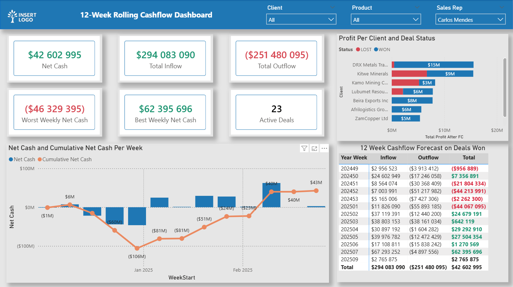
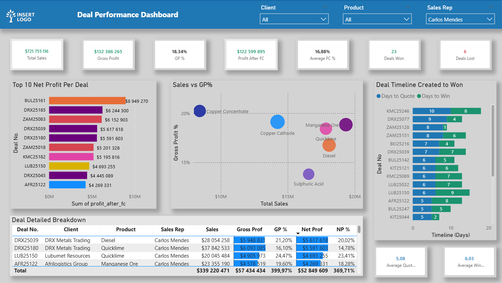
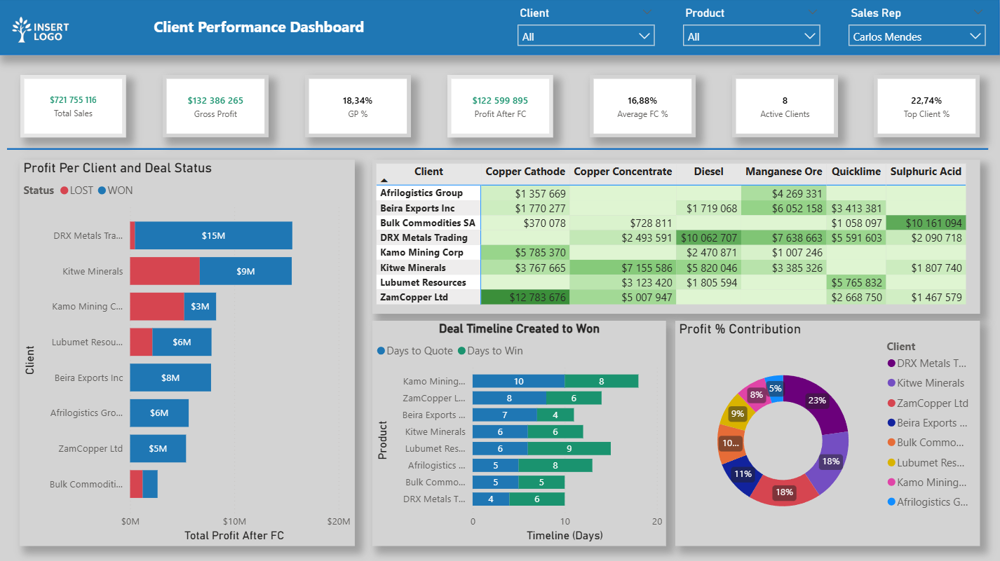
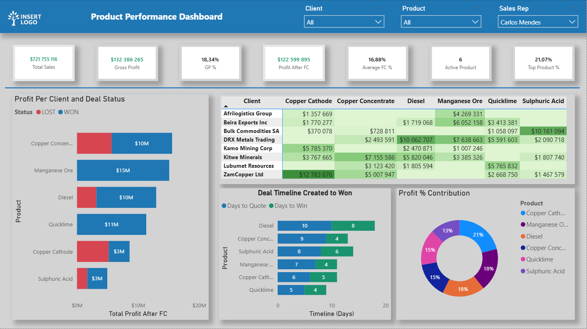

# 📊 12-Week Rolling Cashflow Forecast System

MySQL → Power BI Financial Analytics

This project delivers a complete cashflow forecasting solution that transforms deal-level commercial data into a 12-week forward-looking liquidity model.
It includes SQL-driven cashflow event logic, a normalised MySQL database, and a clean, professional Power BI dashboard.

All data is fully synthetic but designed to reflect realistic commercial behaviour.

## 🧱 1. MySQL Cashflow Data Model

A normalised relational schema that captures all deal, pricing, client, product, and cashflow timing activity.

### Core Entities

- Deals (commercial contracts)
- Cash inflows (deposit and balance receipts)
- Cash outflows (supplier deposits and balances)
- Clients, products, sales reps
- Stock items and cost structures
- Incoterms, deal status codes
- Weekly calendar and ISO week mappings

### Key Features

- SQL logic generates forecasted cashflow events
- Unified inflow/outflow view (**cashflow_forecast_events**)
- Weekly aggregation (**cashflow_weekly**) aligned to ISO week
- Rolling 12-week reporting view (**cashflow_12week**)
- Complete referential integrity between all entities

### Use Cases

- Liquidity planning (12-week horizon)
- Cashflow risk identification
- Client & product cash contribution analysis
- Treasury visibility and deal cash dependency

### 🖼️ Database Schema


---

## 📘 2. Power BI Cashflow Dashboard

An interactive financial reporting interface built on top of the cashflow SQL model.

### Dashboard – 12 Week Finance Model


### 📊 12-Week Rolling Cashflow Dashboard

Dashboard Highlights

- Executive KPI summary (Net Cash, Inflow, Outflow, etc.)
- Weekly inflow/outflow patterns
- Cumulative liquidity curve
- Deal-level breakdown for the selected trader
- Treasury-style cashflow matrix with conditional formatting
- Ability to filter by client, product, or deal



### 📦 Deal Performance Dashboard

Dashboard Highlights

- Total Sales, Gross Profit, Net Profit After Finance Costs
- Top 10 most profitable deals (bar chart)
- Sales vs Gross Profit % (scatter for deal quality)
- Deal timeline: Days to Quote → Days to Win
- Deal profitability table showing GP%, NP%, product mix, and client
- Ideal for analysing commercial performance per trader



### 🧑‍🤝‍🧑 Client Performance Dashboard

Dashboard Highlights

- Profit per client with Lost vs Won comparison
- Client × Product profitability heatmap
- Client deal lifecycle speed (Days to Quote / Days to Win)
- Profit contribution per client (donut visual)
- Helps identify top clients and underperforming relationships



### 📦 Product Performance Dashboard

Dashboard Highlights

- Profitability by product with segmentation across deal statuses
- Product × Client heatmap revealing strong and weak product lines
- Deal timeline by product (sales velocity)
- Total profit contribution by product group
- Supports product strategy and pricing decisions



### 📝 Executive Summary

These four dashboards provide a full commercial and financial performance overview
They cover cashflow, deals, clients, and product behaviour end-to-end
Built using a fully normalised MySQL backend and Power BI data model
All data is synthetic but reflects realistic commercial scenarios

---

## 🧮 3. KPI Definitions (DAX)

### These DAX measures power the top-level KPI cards.

```dax
Total Inflow :=
CALCULATE(
    SUM(cashflow_12week[weekly_amount]),
    cashflow_12week[type] = "Inflow"
)

Total Outflow :=
CALCULATE(
    SUM(cashflow_12week[weekly_amount]),
    cashflow_12week[type] = "Outflow"
)

Net Cash :=
[Total Inflow] + [Total Outflow]

Worst Weekly Net Cash :=
MINX(
    VALUES(cashflow_12week[week_start]),
    CALCULATE([Net Cash])
)

Best Weekly Net Cash :=
MAXX(
    VALUES(cashflow_12week[week_start]),
    CALCULATE([Net Cash])
)

Active Deals :=
DISTINCTCOUNT(cashflow_12week[deal_no])
```

---

## 📊 4. Dashboard Visuals Explained

### KPI Summary Bar  
Shows overall cashflow strength and deal activity in the 12-week window.

### Net Cash & Cumulative Curve  
Combined column + line view:
- Weekly net cash  
- Running liquidity balance  
- Inflection points and recovery periods  

### 12-Week Cashflow Matrix  
A financial-style breakdown (Inflow, Outflow, Net).  
Conditional formatting highlights positive vs negative weekly totals.

### Profit Per Client & Deal Status  
Client ranking based on Profit After Finance Cost, split by WON/LOST deals.

### Deal Performance Table  
Includes:
- Sales  
- Gross Profit  
- GP%  
- NP%  
- Client, Product, Sales Rep  

Useful for bottom-up analysis.

---

## 🔄 5. Cashflow Generation Workflow

- SQL computes deposit, balance, uplift, travel, and payment dates  
- All events converted into cashflow movements  
- Weekly buckets generated using ISO week logic  
- 12-week rolling window exposed to Power BI  
- DAX performs KPIs, formatting, and cumulative logic  

---

## 🔒 Data Notice

All data is fully synthetic and anonymised.  
Structure and behaviour reflect real business logic for demonstration purposes only.

