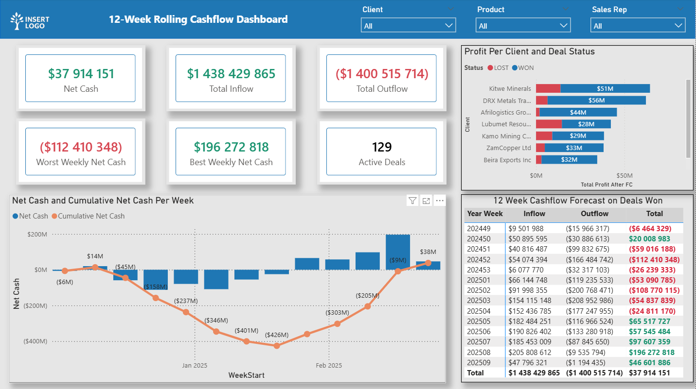

# 📦 Supply Chain Costing System

**Excel Automation + Python ETL + MySQL Database + Power BI Analytics**

This project delivers a complete end-to-end costing and analytics ecosystem combining Excel automation, Python ETL, a fully normalised MySQL database, and Power BI forecasting dashboards.

It replaces fragmented costing spreadsheets with a centralised, automated, and auditable system used to calculate deal costs, gross profit, and cash-flow projections.

---

## 🔒 Data Privacy & Security Notice

All datasets, examples, and sample records used in this repository originate from real operational processes, but no real company data is exposed.  
For security and confidentiality:

- All deal numbers, client names, product codes, transporters, routes, quantities, and financial values have been fully anonymised.  
- Sensitive internal references have been replaced with synthetic values that preserve structure and realism.  
- No proprietary, confidential, or personally identifiable information is present in this repository.

This ensures the project accurately reflects real-world complexity **without compromising any organisational data security standards**.

---

## 🚀 Overview

The system integrates multiple data sources to produce accurate and consistent costing outputs, forecasts, and KPIs:

- **Excel Costing Tool** (Power Query + VBA automation)  
- **SAP SQL Queries** for real-time master data  
- **Python ETL Pipeline** (Monday.com → Excel → MySQL)  
- **MySQL Supply Chain Costing Database**  
- **Power BI Dashboards** (GP analysis, sales conversion, 12-week cashflow forecast, monthly KPIs)

This architecture supports finance, sales, and operations by providing **a single source of truth** for stock, transport, ad-hoc cost, sales, cash flow, and profitability.

---

## 🧩 Key Components

###1️⃣ Excel Costing Workbook

✔ Automated costing template built with Power Query  
✔ 40+ VBA modules (quoting, PDF export, Outlook emails, sheet protection, logging)  
✔ Captures full deal structure:

- Stock cost  
- Transport  
- Ad-hoc cost  
- Finance  
- Gross Profit  

✔ Generates single- & multi-product quotes in minutes

---

### 2️⃣ Python ETL Pipeline

✔ Pulls deal data from Monday.com GraphQL API  
✔ Merges with Excel costing sheets  
✔ Cleans, validates, and transforms data  
✔ Loads into MySQL using incremental upsert logic  
✔ Full logging for traceability and auditability

---

### 3️⃣ MySQL Costing Database

✔ Fully normalised 3NF structure  
✔ Tables include:

- `deal`, `deal_sales_line`, `deal_stock_cost`  
- `deal_transport_cost`, `deal_ad_hoc_cost`  
- `deal_cash_inflow`, `deal_cash_outflow`  
- `product`, `client`, `sales_rep`, `uom`, `deal_status`

✔ Supports financial modelling & Power BI reporting

---

## 🛠️ Tech Stack

| Layer        | Technology |
|--------------|------------|
| Front-End    | Excel, Power Query (M), VBA |
| ETL          | Python (pandas, requests, openpyxl, mysql-connector) |
| Database     | MySQL 8.0 |
| APIs         | Monday.com GraphQL |
| Reporting    | Power BI |
| Version Control | GitHub |

---

## 📊 What the System Delivers

- Standardised costing across all deals  
- Automated quote generation (PDF + Email)  
- Centralised and auditable deal history  
- Integrated financial view of **cost → sales → cashflow**  
- Power BI dashboards for profitability, forecasting, and KPIs  

---

## 🧠 Business Impact

✔ Reduced quote turnaround time from hours to minutes  
✔ Eliminated version-control issues across costing files  
✔ Improved financial accuracy and cost visibility  
✔ Enabled real-time sales & profitability analytics  
✔ Introduced forecasting for cashflow and monthly performance  

---

## 🔮 Power BI Reporting Models

This repository includes two major analytical models powering dashboards used by Finance, Sales, and Leadership.

---

# 📈 1. 12-Week Rolling Cashflow Forecast

A forecasting model that projects cash inflows, cash outflows, and net cash over the next 12 weeks, per deal.

---

## 🔧 SQL Layer (Summary)

The MySQL backend creates:

- A unified cashflow event table (deposit + balance events)
- A weekly bucket view (ISO week start)
- A 12-week filtered dataset for Power BI

This transforms inflow/outflow dates into predictable weekly liquidity projections.

---

## 📊 Power BI Model

- Date table with ISO week logic  
- Weekly cashflow table  
- Relationships to Deals, Product, Client, Sales Rep  
- DAX measures for:

  - Cash Inflow  
  - Cash Outflow  
  - Net Cash  
  - Conditional formatting (Red ↓ / Green ↑)

---

## 📟 Dashboard Features

- Matrix view with Week Numbers & Week Start Dates  
- Cash Outflow block (red), Inflow block (green)  
- Deal-level breakdown  
- Total Cash (Net) per week  

**Filters:**

- Product  
- Client  
- Sales Rep  

Used by finance/treasury to monitor upcoming liquidity requirements.

---

# 📅 2. Monthly KPI Performance Report

Monthly reporting for:

- GP Created  
- GP Quoted  
- GP Won  
- GP Lost  
- Deal volumes  
- Sales totals  
- Profitability measures  

---

## 🔧 SQL Layer (Summary)

Monthly views compute:

- One row per KPI per month  
- Deal count  
- Sales total  
- Gross profit  
- Profit after finance  

---

## 📊 Power BI Model

Includes:

- Month Start  
- KPI Type  
- GP & Revenue Metrics  
- Date table with Year, Month, Month Name  
- DAX for MoM changes & trendlines  

---

## 📟 Dashboard Features

- KPI Cards (GP Created / Quoted / Won / Lost)  
- Monthly trendlines  
- Deal Status breakdowns  
- Slicers for Product, Client, Sales Rep  

---

# 🏁 Summary

This project represents a **complete data engineering + analytics + automation solution** for supply chain costing.

It demonstrates capability across:

- Database design  
- Python ETL engineering  
- Excel/VBA automation  
- Power BI modelling  
- Financial forecasting  
- End-to-end system integration  

Perfect for operational analytics, finance teams, and production-scale reporting environments.

