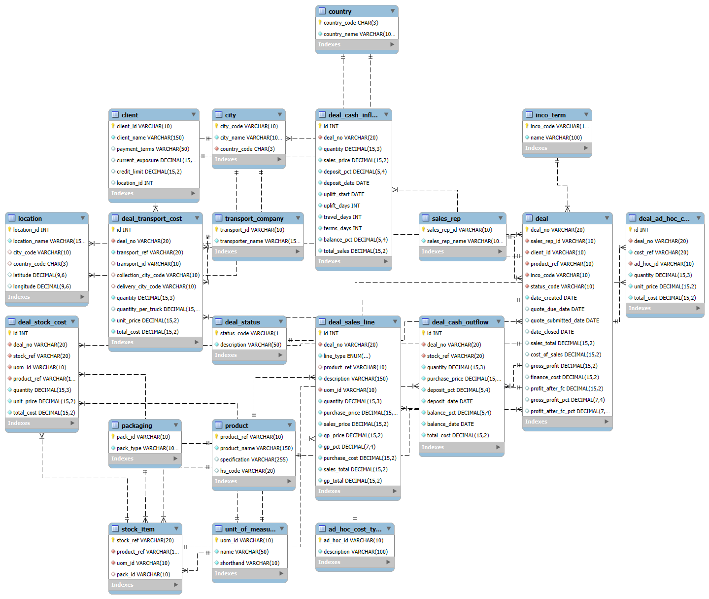

# 🏗️ Supply Chain Costing Database

A relational **MySQL 8.0** database designed to manage and analyze supply chain cost structures, including product pricing, logistics, and deal profitability.  
This database forms the backend foundation for data analysis, Power BI dashboards, and integration with external systems (e.g., Monday.com or Excel data pipelines).

---

## 📘 Overview

The **Supply Chain Costing Database** models the full lifecycle of a commercial deal — from quotation and product sourcing through transport and delivery.  
It is built for **data-driven costing, margin analysis, and cash flow tracking** across multiple deal stages.

The schema is normalized to **3rd Normal Form (3NF)** and includes key functional areas:

- **Master Data** – Clients, Products, Cities, Countries, Sales Reps  
- **Transaction Data** – Deals, Sales Lines, Transport, Ad Hoc Costs, Cash Flows  
- **Reference Tables** – INCO Terms, Deal Status, Units of Measure, Packaging  

---

## 🧩 Database Schema

### Core Tables

| Table | Description |
|--------|--------------|
| **deal** | Central table linking all transactional elements (client, product, sales rep, status, incoterm). Tracks profitability and timeline. |
| **deal_sales_line** | Line-item breakdown of each deal showing quantities, pricing, and gross profit. |
| **deal_stock_cost** | Records stock procurement costs per deal, including quantities, UoM, and total costs. |
| **deal_transport_cost** | Stores transport-related expenses, linked to transport companies and cities. |
| **deal_ad_hoc_cost** | Logs miscellaneous (non-standard) deal costs by cost type. |
| **deal_cash_inflow / deal_cash_outflow** | Track timing and percentage of cash receipts and payments for each deal, useful for cash flow forecasting. |

---

### Master Data Tables

| Table | Description |
|--------|--------------|
| **client** | Contains client details such as payment terms, exposure, and credit limits. |
| **sales_rep** | Stores sales representative names and IDs. |
| **product** | Product master including name, specification, and HS code. |
| **stock_item** | Defines stock units, packaging, and unit of measure per product. |
| **transport_company** | List of available transport service providers. |
| **packaging** | Standard packaging types used in product handling. |
| **unit_of_measure** | Master list of UoM (e.g., KG, L, PCS). |
| **ad_hoc_cost_type** | Lookup table for miscellaneous cost classifications. |

---

### Geography Tables

| Table | Description |
|--------|--------------|
| **country** | Country reference table using ISO country codes. |
| **city** | City master referencing countries. |
| **location** | Combines city and country details for client or logistics points. |

---

### Reference Tables

| Table | Description |
|--------|--------------|
| **deal_status** | Defines deal workflow statuses (e.g., *Created*, *Quoted*, *Won*, *Lost*). |
| **inco_term** | Stores International Commercial Terms (e.g., FOB, CIF, DDP) for trade conditions. |

---

## 🧱 Entity Relationship Diagram (ERD)

### 📊 Text-Based ERD (Quick View)

[client]──< [deal] >──[sales_rep]
│ │ │
│ │ ├──< [deal_sales_line] >──[product]──< [stock_item]
│ │ ├──< [deal_stock_cost]
│ │ ├──< [deal_transport_cost] >──[transport_company]
│ │ ├──< [deal_cash_inflow]
│ │ ├──< [deal_cash_outflow]
│ │ └──< [deal_ad_hoc_cost] >──[ad_hoc_cost_type]
│
├──< [city] >──[country]
│
└──< [location]


### 🖼️ Visual ERD 




---

## 💰 Example Workflow

1. **Deal Created** → Linked to a client, sales rep, and product  
2. **Sales Lines Added** → Define what’s being sold and at what margin  
3. **Cost Lines Recorded** → Include stock, transport, and ad hoc expenses  
4. **Cash Flow Defined** → Capture deposit and balance payment schedules  
5. **Profit Calculated** → Derived from sales vs. total cost fields  

---

## ⚙️ Setup Instructions

### 1. Requirements
- MySQL Server **8.0+**
- MySQL Workbench or CLI
- Privileges for `CREATE`, `ALTER`, and `INSERT`

### 2. Installation

```sql
CREATE DATABASE supply_chain_costing;
USE supply_chain_costing;
SOURCE schema/supply_chain_costing.sql;
3. Verification
sql
Copy code
SHOW TABLES;
📊 Use Cases
Power BI dashboards for profitability visualization

Python ETL pipelines for data automation

Scenario analysis for logistics and deal costing

Cash flow forecasting per deal or client

🧠 Design Notes
Fully normalized schema (3NF)

Strong referential integrity through foreign keys

All currencies stored in DECIMAL(15,2)

Clean separation of master, transaction, and reference data

🧾 Example Query: Gross Profit by Client
sql
Copy code
SELECT 
    c.client_name,
    COUNT(d.deal_no) AS deals_count,
    SUM(d.gross_profit) AS total_gross_profit,
    AVG(d.gross_profit_pct) AS avg_gp_pct
FROM deal d
JOIN client c ON d.client_id = c.client_id
GROUP BY c.client_name
ORDER BY total_gross_profit DESC;

📄 License
Released under the MIT License — free for personal and educational use.

✍️ Author
Andrew Earle
📧 andrew@andrewearle.co.uk

💼 Data Engineering | Business Intelligence | MySQL & Power BI
